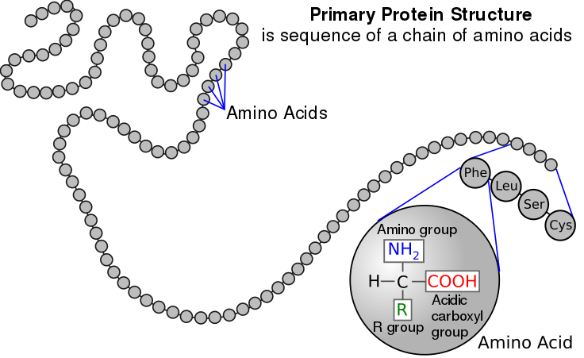
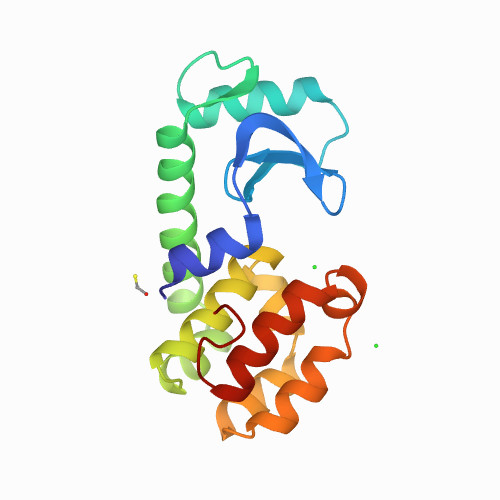
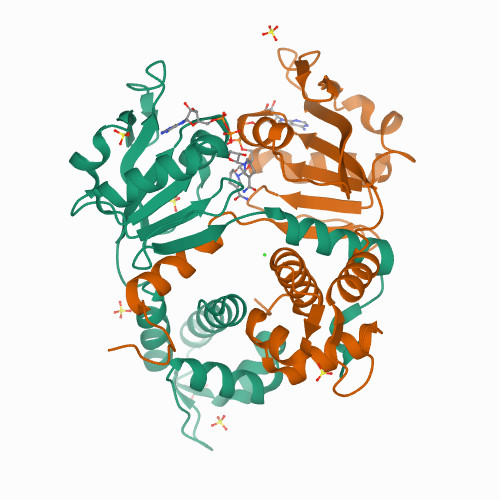
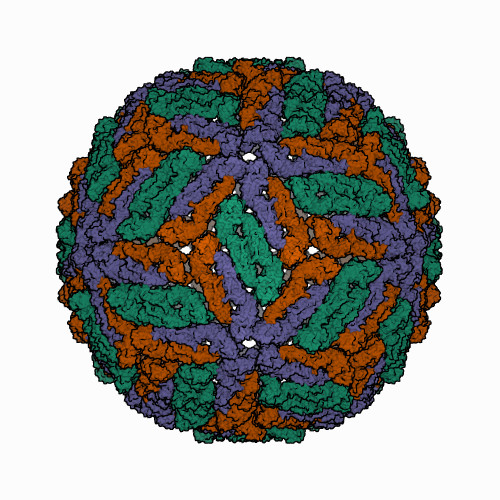
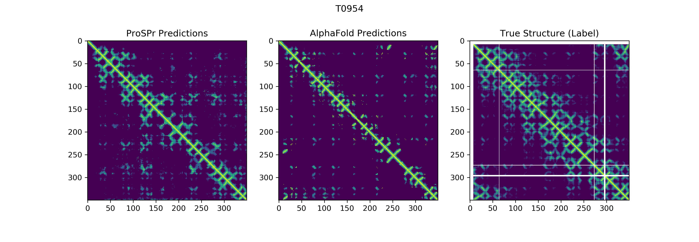
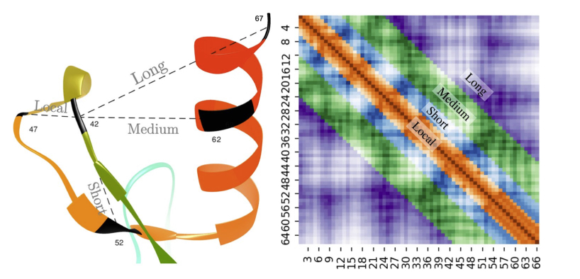
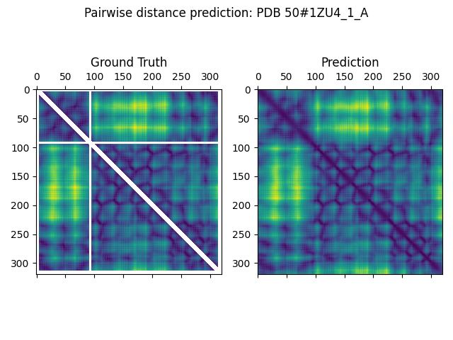
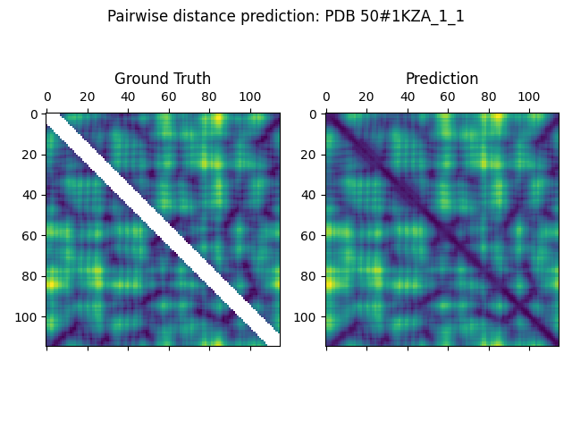
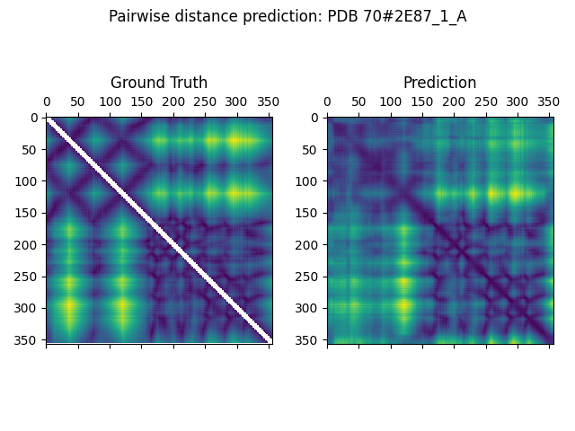
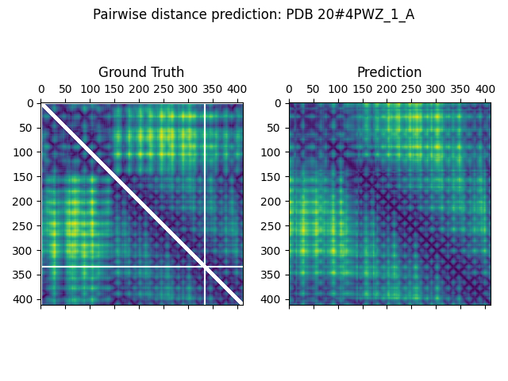

# BERT meets the Protein 3D structure

As we know, BERT has made remarkable results ever in NLP. Recently, some researches are reported which apply BERT to solve some tasks for Protein.

In this article, I introduce how the protein is related with BERT. Furthermore, I will show my own experiment to solve the protein structure, which is one of the most difficult, but important tasks in biochemistry.

## Protein is a sequence

Protein is a sequence of amino acids. There are 20 standard amino acids such as Alanine, Arginine and etc. They are chained from N-term to C-term by peptide bond.

The actual structure of the protein is not like a straight chain, but it can have various 3D structures as below.

The left most is the protein called as [Lysozyme](https://www.rcsb.org/structure/4LZM). You can see that the single chain is folded and consists a 3D structure. Lysozyme is an enzyme. The pocket at the middle plays an important role to grab the specific substrate.

The middle is the [transcription regulator protein](https://www.rcsb.org/structure/2DT5) (and its structure was solved by me). You can see that 2 identical chains are entangled with one another. It suits to bind with DNA. The bottom part binds with DNA and the upper part binds with [NADH+](https://en.wikipedia.org/wiki/Nicotinamide_adenine_dinucleotide). The affinity of binding DNA is controlled by the concentration of NADH+.

The right most is the [Dengue Virus](https://www.rcsb.org/structure/1k4r). It's also made from proteins.

As we have seen above, the 3D structure is important for the protein to perform its functionality. Such structure is implied by the sequence of the amino acids. That's the main idea.

It usually costs a lot to determine 3D structure of protein. So, it's wonderful, if we can know the functionality and structure of the protein from only the sequence information.

## Machine learning tasks in protein 

Protein is a sequence. There are a lot of proteins existing in the world. It's not so difficult to know the sequence itself. It reminds us the BERT in NLP.

Actually, [Ahmed et al.](https://www.biorxiv.org/content/early/2020/07/21/2020.07.12.199554)  released [ProtTrans](https://github.com/agemagician/ProtTrans) recently. ProtTrans is the collection of various transformer models which are pre-trained with 217 million protein sequences. As same as BERT in NLP, they are trained by MLM.

They also publishes the results of some downstream tasks such as Secondary Structure Prediction,  Membrane-bound vs Water-soluble and so on.

Besides the BERT, the machine learning has been used for various protein tasks. 
[AlphaFold](https://deepmind.com/blog/article/AlphaFold-Using-AI-for-scientific-discovery) would be the most famous one. DeepMind has developed AlphaFold to solve the task for predicting Protein 3D structure at 2018. It wins the [CASP13](https://predictioncenter.org/casp13/) which is a competition held for each 2 years.

Unfortunately, the source code of AlphaFold is not published. Instead, community-built, open source implementation, is published [here](https://github.com/dellacortelab/prospr). We can see some results of distance map predictions.

After getting the predicted distance maps, AlphaFold uses SGD and get the final 3D structures.

## BertFold - My own experiment

We have a pre-trained BERT model for protein. How well does it work for predicting 3D structure? It's a natural question.
 
Jesse et al. have inspected another pre-trained BERT model which is made from TAPE dataset. They focus on the attention of the pre-trained model. They have shown that the MLM pre-trained model has already known about the 3D structure.

However, there was no experiment which fine-tunes BERT to predict 3D structure. So, I have tried it.

### Methods

ProtBert was used as a pre-trained model to predict distance map. There's no standard evaluation metric for predicting the distance map in protein. In this experiment, I have applied Long Range MAE8 metrics which is proposed by [Badri et al. at 2020](https://www.nature.com/articles/s41598-020-70181-0)

The idea is ...

* a) If two amino acids are too close in a sequence, it's too easy to predict the distance.
* b) It's important to know whether the two amino acids are contacting or not.

Because of b), it uses only "Long Range" pairs. Because of c), it uses the targets which have a distance less than 8 Å. That's to say, we are interested in the folding.

The ProtBert is 16 layers BERT model. It's so huge, so I used [apex](https://github.com/NVIDIA/apex) half precision with O2 mode and gradiant accumulation.

Any feature engineering was not performed. So, the sequence is the only feature.

### Dataset

[ProteinNet 12](https://github.com/aqlaboratory/proteinnet) was used as a dataset. It's important to apply proper way of splitting, because each proteins are sometimes very similar with each others, as they share an evolutionary relationship. ProteinNet provides the appropriate splittings.

After preprocessing it, I have got 104,029 train samples, 224 val samples and 40 test samples.

### Result

Long range MAE 8

* Val: 4.855
* Test: 7.027

Here are some predicted distance maps.

It looks not so bad as no feature engineering. It's rather surprising for me that MLM trained model can learn the protein structure so easily.

Here are some examples of bad predictions.

They usually exist as a complex. It would be not a good idea to pick up one chain and predict the structure in those cases.

## Summary

The ability of the BERT was also proved in Protein.

Here are the possible improvements.

* Feature engineering like AlphaHold. 
* Using a dataset based on CASP13 (ProteinNet 12 is based on CASP12). 

Further steps.

* Solving the final 3D structure. Predicted angles would be needed beforehand.
* Using the trained BERT to further downstream tasks.
    * Which is better to use the original MLM trained or the trained model here?

All of the code is available in my github repo.